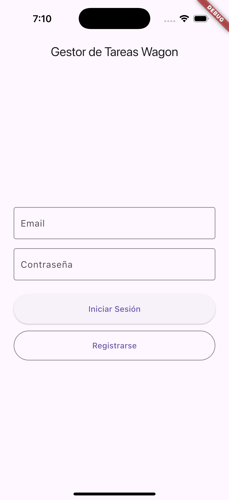
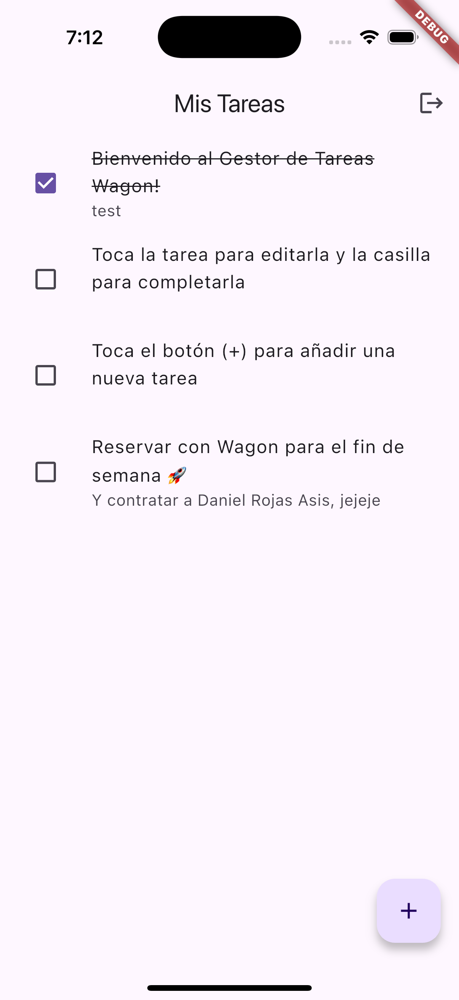
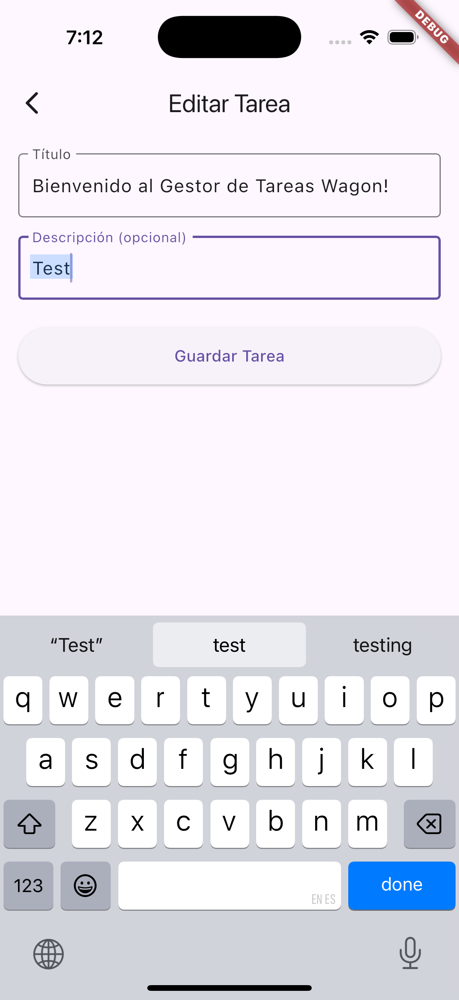
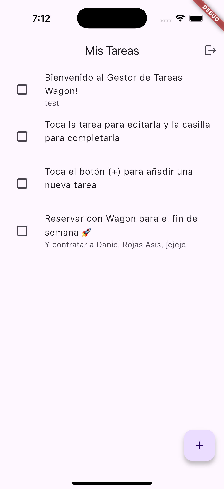
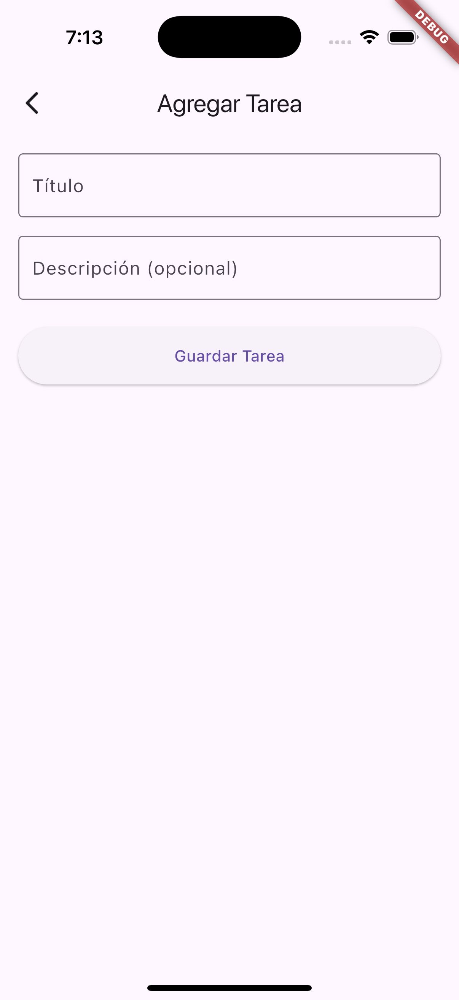

# Gestor de Tareas Personal - Prueba Técnica para Wagon

Este repositorio contiene la solución a la prueba técnica para el puesto de Software Engineer en Wagon. Se ha desarrollado una aplicación full-stack para la gestión de tareas, utilizando Flutter para el cliente móvil y NestJS para la API REST, con despliegue en la nube.

## URLs de Producción
- Backend API: https://wagon-tasks-api.onrender.com
- Documentación Interactiva (Swagger): https://wagon-tasks-api.onrender.com/api

> Nota Importante: El backend está desplegado en el plan gratuito de Render. Si la API no ha recibido tráfico recientemente, el servidor entrará en modo de suspensión. La primera petición puede tardar entre 30 y 60 segundos en recibir respuesta mientras el servicio se activa nuevamente. Las peticiones posteriores serán rápidas.

## Capturas de Pantalla

| Pantalla de Login | Lista de Tareas | Completar Tarea |
| :---------------: | :-------------: | :-----------------: |
|  |  |  |

| Editar Tarea | Tarea Editada | Añadir Tarea |
| :---------------: | :-------------: | :-----------------: |
|  |  |  |

## Probar la App Directamente (Conectada a Producción)
Estas son las instrucciones para que un revisor pueda ejecutar la aplicación móvil y probarla directamente con el backend ya desplegado, sin necesidad de configurar un entorno local.

### Prerrequisitos
- Flutter SDK (v3.22+) instalado.
- Un emulador de Android/iOS o un dispositivo físico.

### Pasos
Clonar el repositorio y navegar a la carpeta mobile:

```bash
git clone https://github.com/tu-usuario/tu-repositorio.git
cd tu-repositorio/mobile
```

Instalar dependencias de Flutter:

```bash
flutter pub get
```

Ejecutar la aplicación:

```bash
flutter run
```

¡Y listo! La aplicación se ejecutará en tu dispositivo y se conectará automáticamente al backend en producción. Puedes crear una cuenta nueva o usar credenciales de prueba.

## Características Principales
- Autenticación Segura: Sistema de registro y login de usuarios mediante Firebase Authentication.
- Gestión de Tareas (CRUD): Funcionalidad completa para crear, leer, actualizar y eliminar tareas.
- Seguridad por Usuario: La API garantiza que cada usuario solo puede acceder y modificar sus propias tareas.
- Interfaz Intuitiva: Diseño móvil limpio con gestos como "deslizar para eliminar" y "tirar para refrescar".
- Onboarding para Nuevos Usuarios: (Función de demostración) Al crear una cuenta nueva, se generan automáticamente tres tareas de bienvenida para guiar al usuario.
- Validación de Datos: La API utiliza DTOs para validar todos los datos de entrada, asegurando la integridad de la información.
- Documentación de API: Endpoints documentados y disponibles para pruebas interactivas a través de Swagger UI.

## Ejecución Local Completa (Backend y Cliente)
Estas instrucciones son para desarrolladores que deseen ejecutar tanto el backend como el cliente en su máquina local.

### Prerrequisitos Adicionales
- Node.js (v18+) y npm.
- Docker Desktop.
- Un proyecto de Firebase con credenciales de Service Account.

### Backend (Carpeta server/)
- Navegar a la carpeta del backend: cd server
- Instalar dependencias: npm install
- Configurar Variables de Entorno: Crea un archivo .env en la raíz de server/ y añade DATABASE_URL y FIREBASE_SERVICE_ACCOUNT.
- Iniciar la Base de Datos con Docker:

```bash
docker run -d --name wagon-postgres-db -e POSTGRES_PASSWORD=12345 -e POSTGRES_USER=postgres -e POSTGRES_DB=tasks -p 5432:5432 -v wagon-pgdata:/var/lib/postgresql/data postgres:14-alpine
```

- Ejecutar el backend: npm run start:dev

### Cliente Móvil (Carpeta mobile/)
- Modificar la URL del Backend: En lib/api/tasks_repository.dart, cambia la variable _baseUrl para que apunte a tu IP local (http://10.0.2.2:3000 para emulador de Android o http://localhost:3000 para simulador de iOS).
- Ejecutar la app: Sigue los pasos de la sección "Probar la App Directamente".

## Decisiones Técnicas Clave
- Estado en Flutter: Se utilizó el patrón BLoC para la gestión de estado. Esta decisión se tomó para separar claramente la lógica de negocio de la UI, lo que resulta en un código más estructurado, escalable y fácil de testear.
- Autenticación en Backend: Se implementó la autenticación mediante una estrategia personalizada con passport-http-bearer. Durante el desarrollo, surgieron inconsistencias en la decodificación del token con passport-firebase-jwt. La estrategia actual nos da control directo sobre la validación del token con el SDK de Firebase Admin, resultando en un flujo más explícito y fácil de depurar.
- ORM y Base de Datos: Se eligió TypeORM por su excelente integración con NestJS. PostgreSQL fue seleccionado por su robustez y fiabilidad.

## Uso de IA
- Se utilizaron herramientas de IA como apoyo en el desarrollo para acelerar tareas y resolver dudas puntuales, siempre manteniendo una revisión y comprensión manual del código generado.
- Gemini: Se usó para generar el esqueleto inicial de algunas funciones, refactorizar código y ayudar en la redacción de este README.md.
- Cursor Tab: Se utilizó para el autocompletado de código repetitivo y la generación de comentarios.